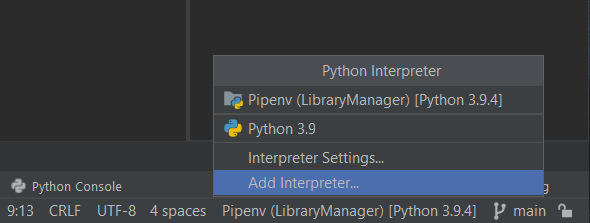

# Hackathon

### Instalar dependências:

Para instalar as dependencias crie uma Pipenv:

#### obs: E necessario ter "pipenv" instalado no seu python para seguir. 

---

Após a instalação execute o comando:

`pipenv install`

### Iniciar:

Execute o arquivo app/main.py

### Banco de dados:

#### Para atualizar banco de dados depois de alterações nos modelos:
Rode os seguintes comandos 

`flask db migrate`

`flask db upgrade`
